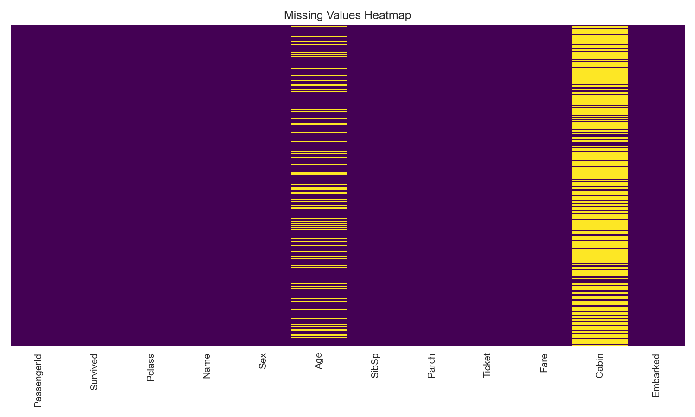
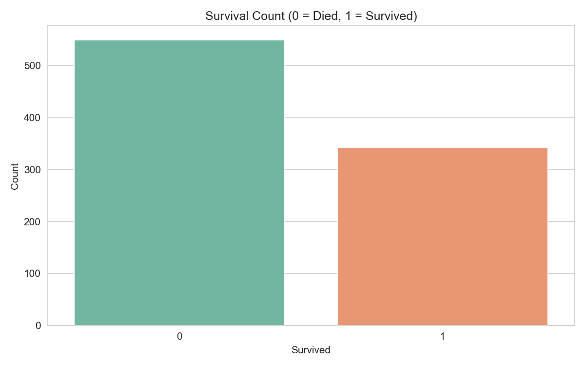
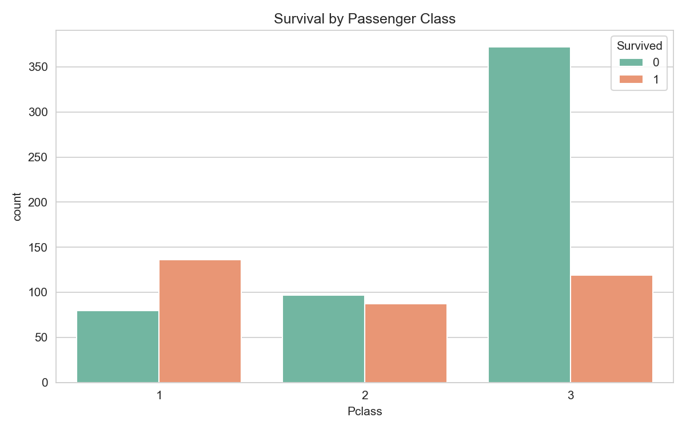
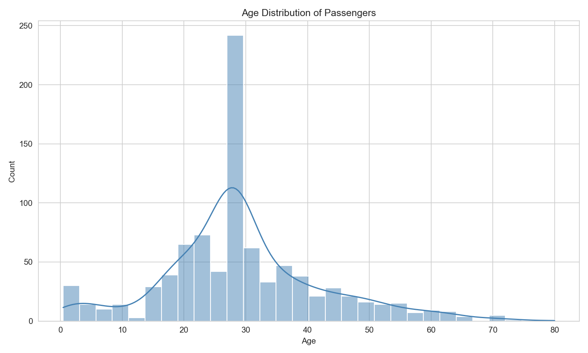
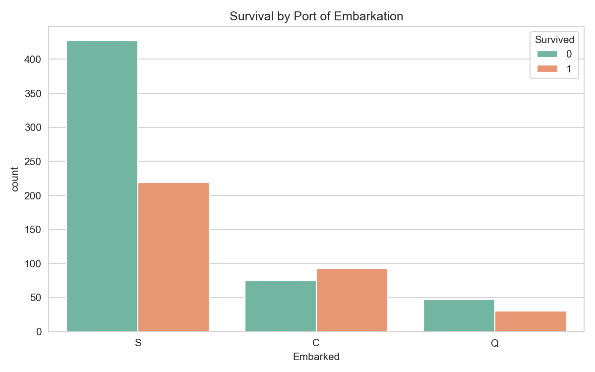
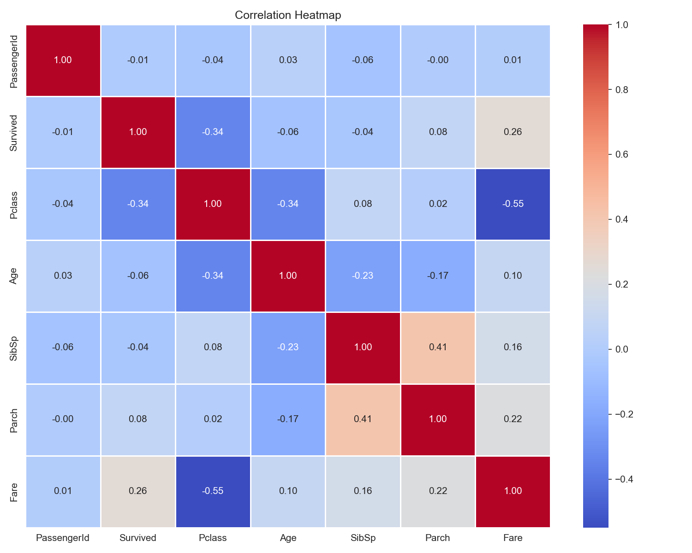
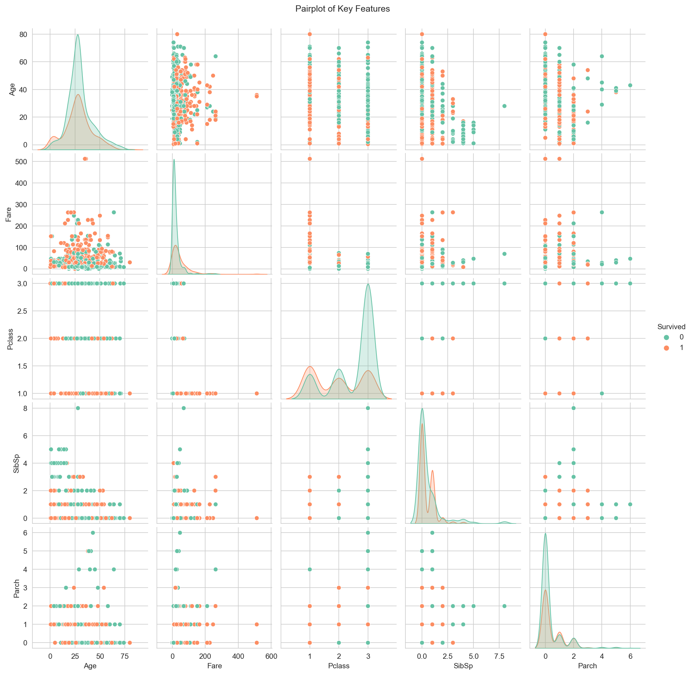
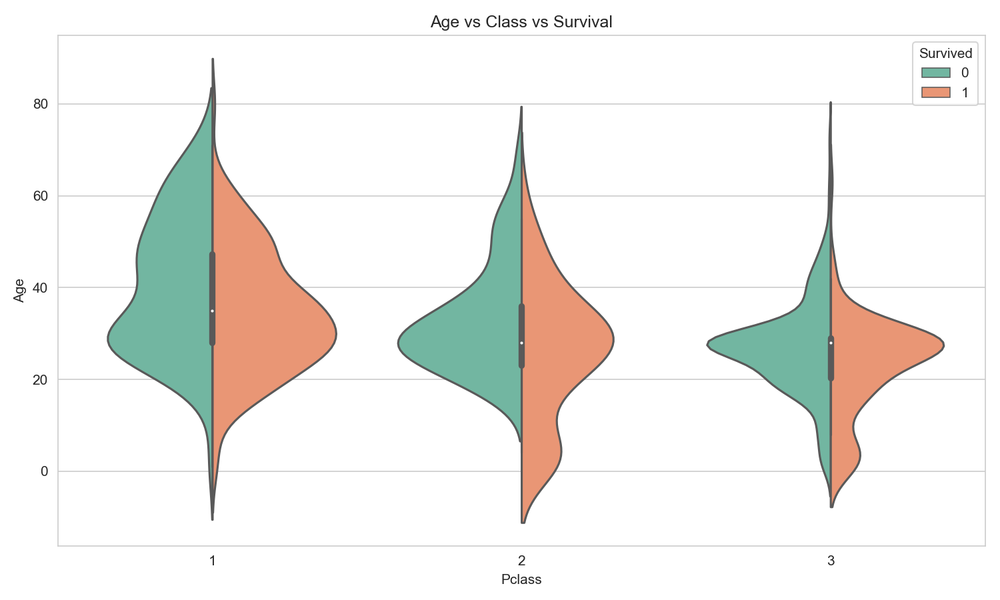

# Task 5: Exploratory Data Analysis (EDA)
## Elevate Labs Data Analyst Internship

**Intern:** Ankita Daweshar  
**Date:** 04 June 2026  
**Tool Used:** Python (Pandas, Matplotlib, Seaborn)  
**Dataset:** Titanic Dataset (Kaggle)

---

## 📌 Objective
Extract meaningful insights from the Titanic dataset using visual
and statistical exploration techniques to identify key factors
that influenced passenger survival.

---

## 📂 Dataset Info
- **Source:** Kaggle — Titanic Dataset
- **Records:** 891 rows × 12 columns
- **Target Variable:** Survived (0 = Did not survive, 1 = Survived)
- **Key Features:** Age, Sex, Pclass, Fare, Embarked, SibSp, Parch

---

## 🔍 EDA Steps Performed

### Data Quality
| Step | Action |
|------|--------|
| Missing Values | Age → filled with median, Cabin → dropped, Embarked → filled with mode |
| Data Types | Verified all columns have correct types |
| Duplicates | No duplicate rows found |

### Analysis Performed
| # | Analysis | Type | Chart Used |
|---|----------|------|------------|
| 1 | Missing Values Check | Data Quality | Heatmap |
| 2 | Survival Distribution | Univariate | Count Plot |
| 3 | Age Distribution | Univariate | Histogram + KDE |
| 4 | Survival by Passenger Class | Bivariate | Count Plot |
| 5 | Survival by Embarkation Port | Bivariate | Count Plot |
| 6 | Correlation Heatmap | Multivariate | Heatmap |
| 7 | Feature Relationships | Multivariate | Pairplot |
| 8 | Age + Class + Survival | Multivariate | Violin Plot |

---

## 💡 Key Findings

- Only **38.4%** of passengers survived the Titanic disaster
- **1st class** passengers had **63%** survival vs **24%** for 3rd class
- **Children under 10** had notably higher survival rates
- **Higher fare** strongly correlated with better survival chances
- Passengers from **Cherbourg** had the highest survival rate **(55%)**
- **Pclass, Fare and Age** were the most correlated features with survival
- Passengers with **1-2 family members** survived more than those alone or in large groups

---

## 📊 Visualizations

### 01 — Missing Values Heatmap

### 02 — Survival Count

### 03 — Survival by Passenger Class

### 04 — Age Distribution

### 05 — Survival by Embarkation

### 06 — Correlation Heatmap

### 07 — Pairplot

### 08 — Violin Plot (Age + Class + Survival)

---

## 📁 Files in this Repository

| File | Description |
|------|-------------|
| `task5_eda_titanic.ipynb` | Complete EDA Jupyter Notebook |
| `task5_eda_report.docx` | Detailed Word report with observations |
| `task5_eda_report.pdf` | PDF version of the report |
| `Titanic-Dataset.csv` | Raw dataset |
| `src/` | All saved visualization plots (8 figures) |

---

## 🛠️ Libraries Used
- `pandas` — data manipulation and analysis
- `numpy` — numerical operations
- `matplotlib` — base plotting library
- `seaborn` — statistical data visualization

---

## ✅ Summary
| Metric | Value |
|--------|-------|
| Dataset Size | 891 rows × 12 columns |
| Visualizations Created | 8 |
| Missing Values Handled | 3 columns |
| Key Insights Generated | 7 |
| Analysis Types | Univariate, Bivariate, Multivariate |
